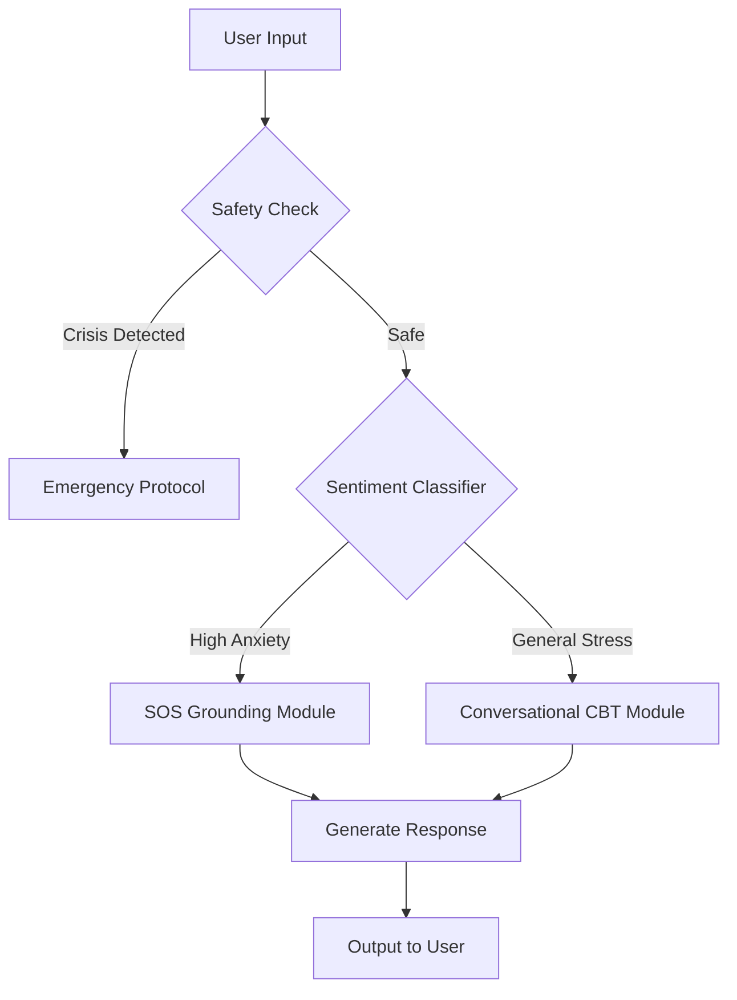

# Anchor: AI-Powered Anxiety Relief Companion


## Overview

**Anchor** is a real-time mental health intervention tool designed to de-escalate anxiety attacks and provide grounding techniques using Generative AI.

While generic chatbots often provide vague advice, Anchor utilizes a **Retrieval-Augmented Generation (RAG)** pipeline grounded in Cognitive Behavioral Therapy (CBT) principles. It features strict safety guardrails to ensure responses are empathetic, actionable, and non-clinical—acting as an immediate "digital anchor" for users in distress.

## Key Features

- **SOS Grounding Mode** — A low-latency, high-priority workflow that immediately guides users through the 5-4-3-2-1 technique or breathing exercises when high distress is detected.
- **Sentiment & Urgency Classification** — Uses a pre-classification agent to detect the severity of user input (e.g., General Stress vs. Panic Attack) and routes the conversation to the appropriate model logic.
- **Personalized Affirmation Engine** — Generates context-aware affirmations based on user-specific triggers, stored in a local vector memory.
- **Privacy-First Architecture** — Ensures user session data is anonymized and not used for model training.

## Architecture & Tech Stack

### Core Components

| Layer | Technology |
|-------|------------|
| Frontend | Streamlit (prototype) / React Native (planned) |
| Orchestrator | LangChain |
| LLM | GPT-4o (complex reasoning) / GPT-3.5-Turbo (low-latency) |
| Vector Database | Pinecone |

### Data Flow

1. **Input Analysis** — User text/voice is analyzed for sentiment score (-1.0 to 1.0)
2. **Safety Guardrails** — Input is checked against self-harm/crisis protocols. If critical, emergency resources are provided immediately.
3. **Context Retrieval** — The system retrieves relevant grounding techniques from the vector database
4. **Response Generation** — The LLM constructs a response using a therapeutic persona system prompt focused on de-escalation

## System Architecture



## Engineering Challenges & Solutions

| Challenge | Solution |
|-----------|----------|
| Latency during panic attacks is unacceptable | Implemented a "Hybrid Routing" system—if SOS keywords are detected, the system bypasses complex RAG lookup and serves a cached, immediate grounding exercise |
| Hallucination of medical advice | Strict system prompting ("You are a supportive companion, not a doctor") and temperature set to 0.2 for deterministic, consistent outputs |

## Getting Started

```bash
# Clone the repository
git clone https://github.com/yourusername/anchor.git

# Install dependencies
pip install -r requirements.txt

# Run the application
streamlit run app.py
```

Open [http://localhost:3000](http://localhost:3000) in your browser to view the application.

## Author

**Anthony Lee**
Creative AI Engineer

---

*Disclaimer: Anchor is not a substitute for professional mental health care. If you are in crisis, please contact a mental health professional or emergency services.*
