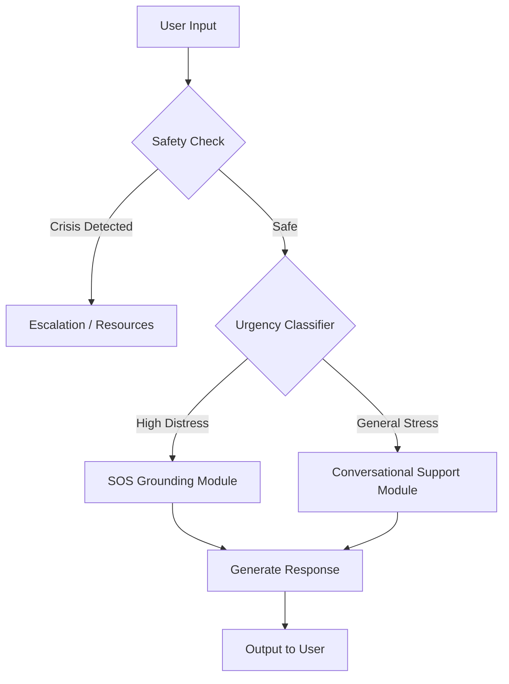

# Anchor: AI-Powered Wellness Companion


## Overview

**Anchor** is an AI-powered wellness companion that provides grounding support during moments of stress and anxiety. It is designed for fast, low-friction stress and anxiety de-escalation—offering immediate, non-clinical support when someone needs to steady themselves.

Rather than generic advice, Anchor focuses on guided grounding workflows drawn from established coping techniques (such as paced breathing and cognitive reframing). It pairs a calm, focused interface with safety-aware response design so that support stays empathetic, actionable, and clearly non-clinical—acting as an immediate "anchor" when distress runs high.

## Key Features

- **Breathe** — A guided paced-breathing experience with an animated breathing circle to help slow the body's stress response.
- **Vent** — A "worry shredder" flow that lets users externalize anxious thoughts and release them, then transition into a calming exercise.
- **Clarity** — A cognitive reframing tool that helps users reinterpret anxious thoughts into more balanced perspectives.
- **Urgency-Aware Routing** — Interaction flows are designed so that high-distress moments route to immediate grounding guidance rather than slower, heavier workflows.
- **Privacy-First Design** — Built to avoid unnecessary retention of personal distress details, keeping session context lightweight.
- **Installable PWA** — Ships as a Progressive Web App for an app-like, offline-friendly experience.

## Architecture & Tech Stack

| Layer | Technology |
|-------|------------|
| Frontend | Next.js / TypeScript |
| UI | React components, CSS |
| AI Workflow | RAG-informed response flow, urgency routing |
| Safety Layer | crisis detection, non-clinical guardrails |
| Data | local/session-based context; vector memory planned |

## System Architecture


```mermaid
graph TD
    A[User Input] --> B{Safety Check}
    B -->|Crisis Detected| C[Escalation / Resources]
    B -->|Safe| D{Urgency Classifier}
    D -->|High Distress| E[SOS Grounding Module]
    D -->|General Stress| F[Conversational Support Module]
    E --> G[Generate Response]
    F --> G
    G --> H[Output to User]
```

## Engineering Challenges & Solutions

| Challenge | Solution |
|-----------|----------|
| Latency during high-distress moments | SOS keywords route users to immediate grounding guidance instead of slower retrieval workflows. |
| Risk of medical overclaiming | Responses are framed as supportive, non-clinical grounding guidance, not diagnosis or treatment. |
| Hallucinated advice | Guardrails constrain the assistant to practical coping steps and escalation guidance when needed. |
| Sensitive user context | Privacy-first design avoids unnecessary retention of personal distress details. |

## Current Status

Anchor is an MVP full-stack AI product prototype focused on user-facing AI experience, urgency routing, grounding workflows, and safety-aware response design.

## Non-Goals

- Anchor does not diagnose, treat, or provide medical care.
- Anchor is not a substitute for professional mental health support.
- Anchor does not replace crisis services.
- Anchor is a portfolio prototype demonstrating safety-aware AI product design.

## Getting Started

```bash
npm install
npm run dev
```

Open [http://localhost:3000](http://localhost:3000) in your browser.

## Author

**Anthony Lee**
Creative AI Engineer

---

> ⚠️ **Disclaimer:** Anchor is not a substitute for professional mental health care. It does not diagnose or treat any condition. If you are in crisis, please contact a mental health professional or emergency services.
